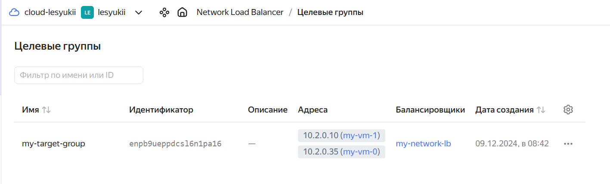
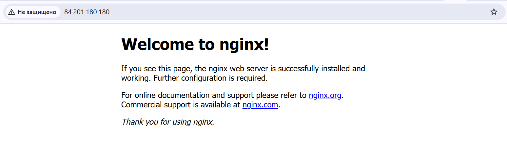
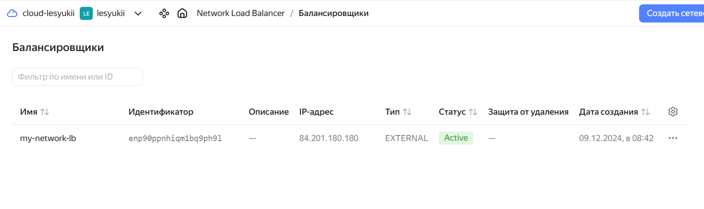

# Домашнее задание к занятию "`Отказоустойчивость в облаке`" - `Лесюк Иван`

---

### Задание 1

**Описание задания:**  
Необходимо с помощью Terraform создать инфраструктуру в Яндекс.Облаке, включающую:

1. Две идентичные виртуальные машины (ВМ), созданные с помощью `count`.
2. Таргет-группу, включающую обе ВМ.
3. Сетевой балансировщик нагрузки, перенаправляющий трафик на порт 80 ВМ и проверяющий их работоспособность с помощью HTTP healthcheck.

На созданных ВМ должен быть установлен и запущен Nginx на порту 80. При обращении к внешнему IP балансировщика по порту 80 должна отображаться дефолтная страница Nginx.

**Выполненные шаги:**

1. Настроил провайдер `yandex` в Terraform.
2. Создал сеть, подсеть и две ВМ.
3. Настроил `user-data` для автоматической установки и запуска Nginx.
4. Создал таргет-группу с обеими ВМ.
5. Создал балансировщик нагрузки с HTTP listener и healthcheck.

**Результат:**  
- Балансировщик в статусе `Active`.
- Обе ВМ `healthy` в таргет-группе.
- При обращении к внешнему IP-адресу балансировщика отображается страница Nginx.

---

### Скриншоты

1. **Целевая группа:**  
   

2. **Дефолтная страница Nginx:**  
   

3. **Балансировщик:**  
   

---

### Файл с кодом

- [main.tf](./main.tf) — Terraform-конфигурация 